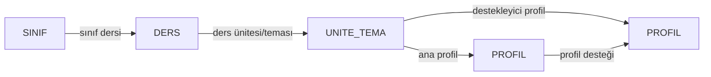

# Ağ Analizi Raporu - Excel Veri Şeması

Bu sayfa artık eski diyagram, `abc.md`, KB2 veya KB3 verisi kullanmaz. Ağ verisi yalnızca `C:\Users\vedat\Desktop\exceller` klasöründeki Excel dosyalarından üretilir.

## Ana Köprüler

| Amaç | Dosya |
|---|---|
| Sayfa ve canvas arayüzü | `PersonelTakipSistemi/Views/ProgramGelistirme/AgAnaliziRaporu.cshtml` |
| Sayfanın okuduğu JSON | `PersonelTakipSistemi/wwwroot/data/ogrenci_profili_ag_verisi.json` |
| Excelden JSON üreten script | `scripts/generate_ogrenci_profili_ag_verisi.py` |

Sayfa veriyi bu satırdan okur:

```js
const dataSourceUrl = '/data/ogrenci_profili_ag_verisi.json';
```

## Excel Alanları

Her Excel satırı şu alanlardan okunur:

| Excel alanı | Ağdaki karşılığı |
|---|---|
| `SINIF SEVİYESİ` | `SINIF` düğümü |
| `DERS ADI` / `Ders` | `DERS` düğümü |
| `ÜNİTE /ÖĞRENME ALANI/TEMA` / `TEMA` | `UNITE_TEMA` düğümü |
| `ANA PROFİL` | `PROFIL` düğümü ve `ana profil` ilişkisi |
| `DESTEKLEYİCİ PROFİL` | `PROFIL` düğümü ve `destekleyici profil` / `profil desteği` ilişkisi |

Boş bırakılan sınıf ve ders hücreleri Exceldeki grup mantığına göre yukarıdaki son dolu satırdan tamamlanır. Böylece aynı sınıf/ders altında devam eden ünite satırları kaybolmaz.

## İlişki Şeması



## Güncel Veri Özeti

Son üretimde JSON şu özetle oluşturuldu:

| Metrik | Değer |
|---|---:|
| Excel dosyası | 9 |
| Okunan satır | 219 |
| Atlanan satır | 0 |
| Sınıf | 8 |
| Ders | 7 |
| Ünite / Tema | 134 |
| Profil | 10 |
| İlişki | 757 |

## Özelleştirme Noktaları

| Köprü | Ne için kullanılır? |
|---|---|
| `SOURCE_FILES` | Hangi Excel dosyalarının okunacağını belirler. |
| `PROFILE_ALIASES` | Exceldeki yazım farklarını tek profile bağlar. Örnek: `Üretkenlik -> Üretken`. |
| `LESSON_NAMES` | Ders adlarını tek biçime getirir. |
| `split_profiles()` | Destekleyici profil hücresindeki virgül, noktalı virgül, eğik çizgi ve eksik ayırıcıları parçalar. |
| `relation_buckets` | Sınıf-ders-ünite-profil ilişkilerinin nasıl kurulacağını belirler. |
| `PALETTE` / `HC_PALETTE` | Grup renklerini belirler. |

Excel verileri değiştiğinde JSONu yeniden üretmek için:

```powershell
$env:PYTHONIOENCODING='utf-8'
& 'C:\Users\vedat\.cache\codex-runtimes\codex-primary-runtime\dependencies\python\python.exe' 'C:\Users\vedat\source\repos\PersonelTakipSistemi\scripts\generate_ogrenci_profili_ag_verisi.py'
```
